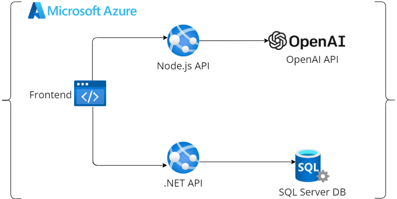

# Proyecto Clon de Tesla con Recomendaciones Basadas en IA

Este proyecto es un clon de la página de Tesla, creado como un MVP para mostrar mis habilidades en desarrollo web y en la integración de tecnologías avanzadas como inteligencia artificial. La aplicación permite a los usuarios recibir recomendaciones de vehículos basadas en sus preferencias, así como interactuar con una funcionalidad de texto a voz para mejorar la accesibilidad.

## Descripción General del Proyecto

### Componentes Principales

- **Frontend**: 
  - **Tecnologías**: React, Tailwind CSS, Redux, Framer Motion.
  - **Funcionalidad**:
    - Interfaz de usuario del clon de Tesla.
    - **Sección "Ayúdame a elegir" con recomendaciones basadas en IA.**
    - Funcionalidad de texto a voz (Speech to Text) que convierte el texto de cada recomendación en audio.
    - Generación de Perfiles: Tres botones para generar perfiles profesionales, familiares o generales para usuarios que no saben por dónde empezar. Cada botón genera un perfil utilizando AI, que luego puede ser editado antes de enviar.

- **API de Node.js**:
  - **Tecnologías**: Node.js, Express.js, Axios.
  - **Funcionalidad**:
    - Endpoint para generar recomendaciones de vehículos basadas en la entrada del usuario.
    - Endpoint para convertir texto en voz utilizando la API de OpenAI TTS (Text-to-Speech).
    - Endpoints para generar perfiles (profesional, familiar, general) basados en la entrada del usuario.
  
- **API de .NET**:
  - **Tecnologías**: .NET Core.
  - **Funcionalidad**:
    - Endpoint que proporciona datos sobre las especificaciones de los vehículos.
    - Acceso a la base de datos SQL Server para obtener información detallada sobre los modelos.

- **Base de Datos SQL Server**:
  - **Funcionalidad**:
    - Almacena las especificaciones de los vehículos.
    - Los datos son accesibles a través de la API de .NET para ser presentados en el frontend.

### Arquitectura del Proyecto


- **Despliegue**:
  - La aplicación está desplegada en Azure, utilizando App Services para las APIs y la base de datos, y una Static Web App para el frontend.
  - **Estructura del Proyecto**:
    - **Repositorio 1**: Frontend
    - **Repositorio 2**: API de Node.js
    - **Repositorio 3**: API de .NET
    - **Repositorio 4**: Scripts de Base de Datos SQL Server

## Detalles Técnicos por Repositorio

1. **Frontend**
   - **URL del Repositorio**: [Enlace al repositorio de Frontend](https://github.com/MarcoAlayn/tesla-landing-ia)
   - **Descripción**: Contiene la implementación de la interfaz de usuario del clon de Tesla.
   - **Tecnologías Clave**:
     - React: Manejo de la interfaz y componentes.
     - Tailwind CSS: Diseño de la interfaz.
     - Redux: Manejo del estado de la aplicación.
     - Framer Motion: Animaciones en los sliders de recomendaciones.
   - **Funcionalidad Adicional**:
     - Speech to Text: Botón en cada slide que permite convertir el texto de la recomendación en voz.
     - Generación de Perfiles: Tres botones que permiten generar perfiles (profesional, familiar, general) para ayudar a los usuarios a empezar. Cada perfil se puede editar antes de enviarlo para obtener recomendaciones personalizadas.

2. **API de Node.js**
   - **URL del Repositorio**: [Enlace al repositorio de Node.js API](https://github.com/MarcoAlayn/node_api_open_ai)
   - **Descripción**: Se encarga de la lógica de generación de recomendaciones, conversión de texto a voz y generación de perfiles.

3. **API de .NET**
   - **URL del Repositorio**: [Enlace al repositorio de .NET API](https://github.com/MarcoAlayn/DotNetApiTesla)
   - **Descripción**: Proporciona datos sobre las especificaciones de los vehículos.

4. **Base de Datos SQL Server**
   - **URL del Repositorio**: [Enlace al repositorio de Scripts de Base de Datos](https://github.com/MarcoAlayn/CarSalesDB)
   - **Descripción**: Scripts para replicar la base de datos que almacena las especificaciones de los vehículos.
   - **Contenido**:
     - Scripts de creación de tablas.
     - Descripción de las tablas y columnas.

## Diagrama de Secuencia

```mermaid
sequenceDiagram
    participant Usuario
    participant Frontend
    participant Node.js API
    participant OpenAI API
    participant .NET API
    participant SQL Server DB

    Usuario->>Frontend: Introduce preferencias y necesidades
    Frontend->>Node.js API: Envía datos del usuario para recomendación
    Node.js API->>OpenAI API: Solicita recomendación basada en datos
    OpenAI API-->>Node.js API: Retorna recomendación de vehículo
    Node.js API-->>Frontend: Envía recomendación con modelo y color
    Usuario->>Frontend: Navega entre las recomendaciones
    
    Usuario->>Frontend: Solicita especificaciones detalladas
    Frontend->> .NET API: Solicita especificaciones del modelo
    .NET API->>SQL Server DB: Consulta especificaciones del modelo
    SQL Server DB-->>.NET API: Retorna especificaciones del modelo
    .NET API-->>Frontend: Envía especificaciones detalladas
    Frontend-->>Usuario: Muestra especificaciones del modelo
    
    Usuario->>Frontend: Solicita convertir texto a voz
    Frontend->>Node.js API: Envía texto para conversión a voz
    Node.js API->>OpenAI API: Solicita conversión de texto a voz
    OpenAI API-->>Node.js API: Retorna archivo de audio
    Node.js API-->>Frontend: Envía archivo de audio
    Frontend-->>Usuario: Reproduce audio de recomendación
    
    Usuario->>Frontend: Selecciona perfil a generar
    Frontend->>Node.js API: Solicita generación de perfil (profesional, familiar, general)
    Node.js API->>OpenAI API: Solicita generación de perfil basado en el tipo seleccionado
    OpenAI API-->>Node.js API: Retorna perfil generado
    Node.js API-->>Frontend: Envía perfil generado
    Frontend-->>Usuario: Muestra perfil generado para edición o envío
